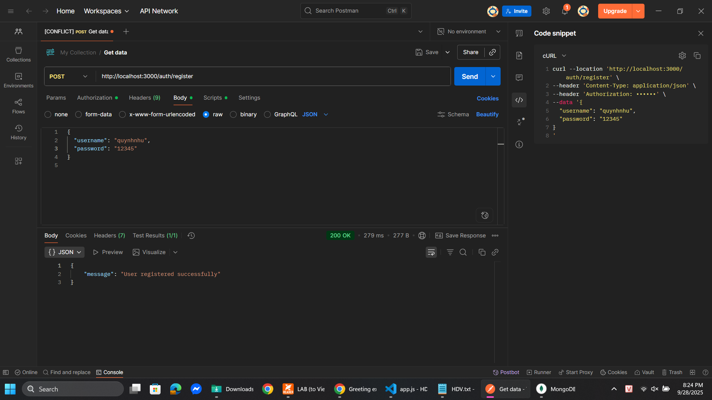
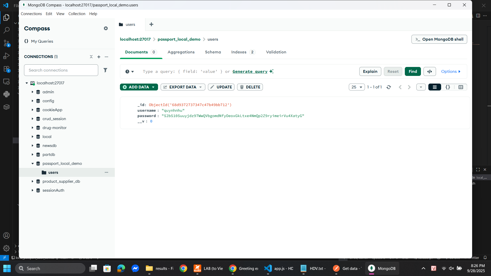
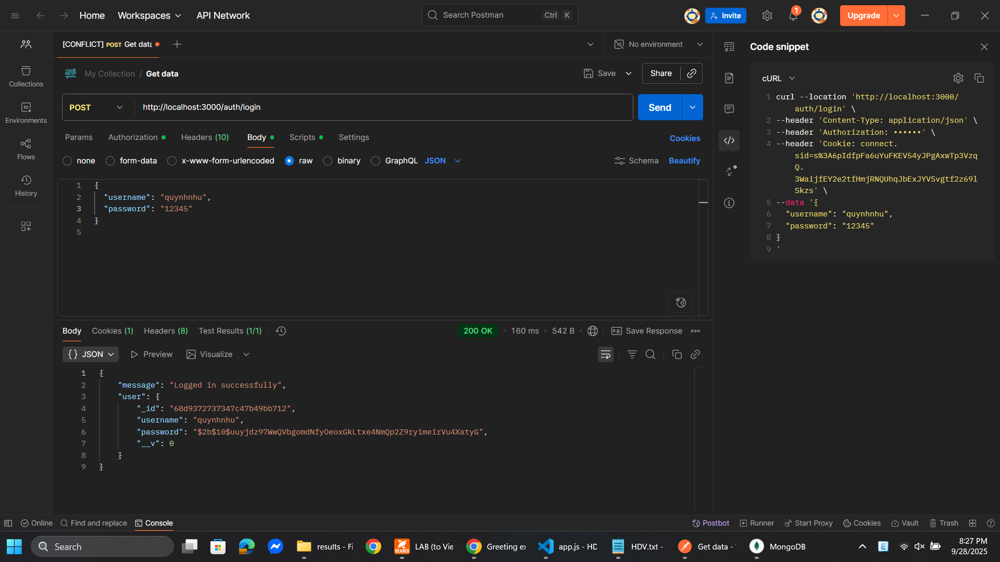
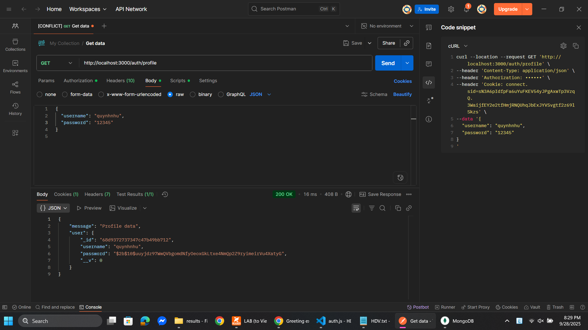
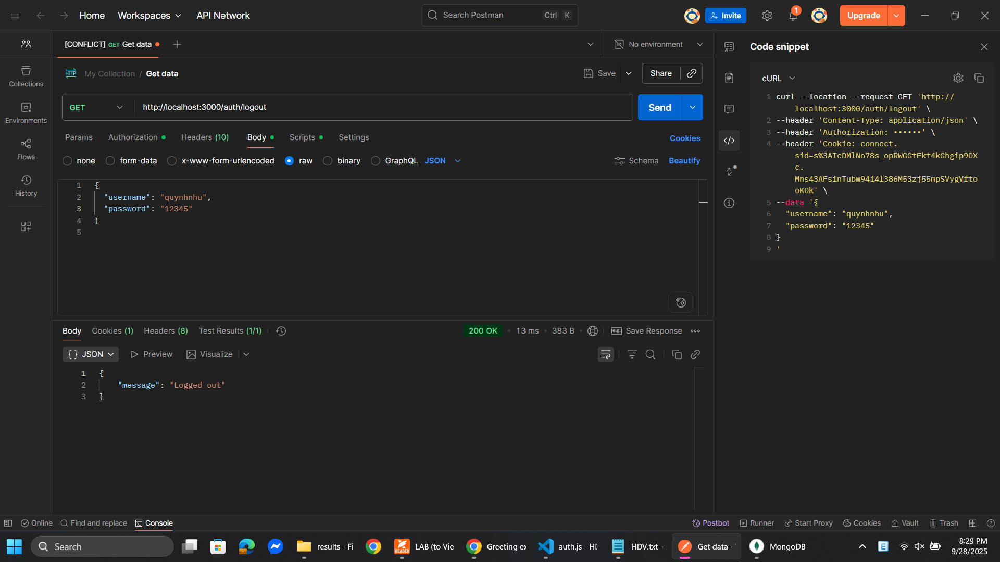

# local_passport_auth_service

## Cách chạy

```bash
npm install
node app.js
```

Server chạy tại: `http://localhost:3000`

---

## API Endpoints

* `POST /auth/register` → Đăng ký
* `POST /auth/login` → Đăng nhập
* `GET /auth/profile` → Trang cá nhân (yêu cầu đã login)
* `GET /auth/logout` → Đăng xuất

---

## Cách test với Postman

### Register

* `POST http://localhost:3000/auth/register`
* Body → Raw JSON:

```json
{
  "username": "quynhnhu",
  "password": "12345"
}
```

* Kết quả:

```json
{ "message": "User registered successfully" }
```

---

### Login

* `POST http://localhost:3000/auth/login`
* Body → Raw JSON:

```json
{
  "username": "quynhnhu",
  "password": "12345"
}
```

* Kết quả (ví dụ):

```json
{
  "message": "Logged in successfully",
  "user": {
    "_id": "68d9372737347c47b49bb712",
    "username": "quynhnhu",
    "password": "$2b$10$uuyjdz97WwQVbgomdNfyOeoxGkLtxe4NmQp2Z9ryimeirVu4XatyG",
    "__v": 0
  }
}
```

* Tab **Cookies** → thấy `connect.sid=...`

---

### Profile

* `GET http://localhost:3000/auth/profile`
* Postman tự gửi cookie kèm request
* Nếu còn hiệu lực → trả về:

```json
{
  "message": "Profile data",
  "user": {
    "_id": "68d9372737347c47b49bb712",
    "username": "quynhnhu",
    "password": "$2b$10$uuyjdz97WwQVbgomdNfyOeoxGkLtxe4NmQp2Z9ryimeirVu4XatyG",
    "__v": 0
  }
}
```

---

### Logout

* `GET http://localhost:3000/auth/logout`
* Session bị xoá và cookie `connect.sid` cũng bị xoá
* Kết quả:

```json
{ "message": "Logged out" }
```

---

## Hình minh họa


*Đăng ký user thành công*


*Kiểm tra collection `users` trong MongoDB sau khi register*


*Đăng nhập thành công, cookie được cấp*


*Truy cập profile khi session hợp lệ*


*Đăng xuất, session và cookie bị xoá*
